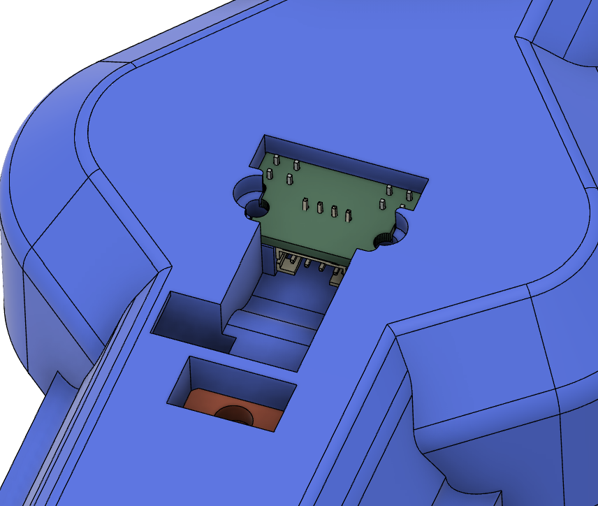

This is a PCB that simplifies the wiring of IR reflective sensors for use as tachometers in closed-loop brushed nerf flywheelers.

### Bill of materials:
 - Two [ITR20001-T sensors](https://www.adafruit.com/product/3930)
 - Two 470 ohm 1210 size resistors of your choosing (I chose [these](https://www.mouser.com/ProductDetail/Vishay-Dale/CRCW1210470RFKEA?qs=3R%2Fk7NrOSuXsW0BlMRX%252BmQ%3D%3D))
 - One [four-pin horizontal JST-PH connector](https://www.mouser.com/ProductDetail/JST-Commercial/S4B-PH-K-SLFSN?qs=QpmGXVUTftG04YaiaFwjFQ%3D%3D)

### Protean integration

I will publish the STEP files for the modified protean reviever cover once they have been printed and tested.

